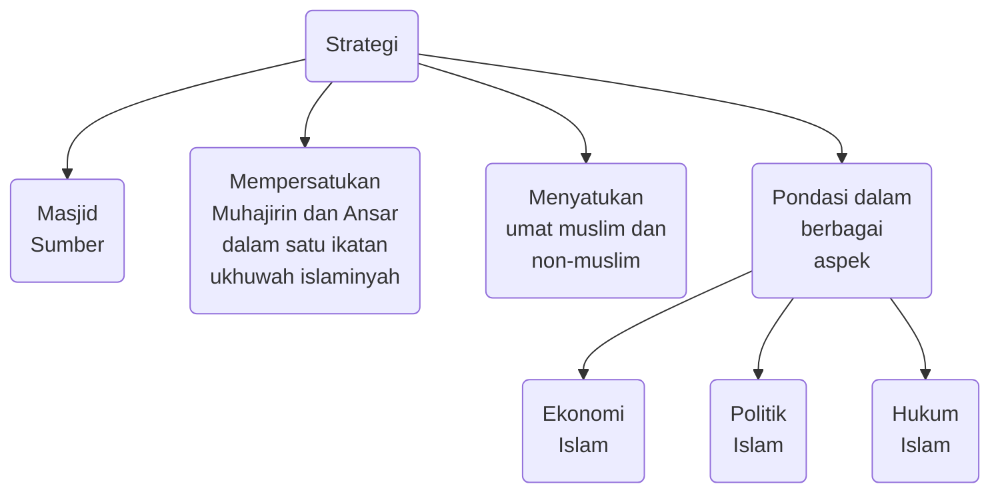
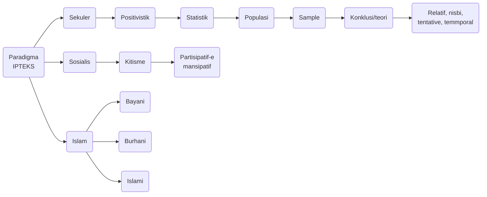

# UAS

## Akhlak

### Makna Etika

Ajaran yang membahas kebaikan dan keburukan berdasarkan ukuran akal. Karena etika bersumber dari filsafat.

### Makna Moral

Ajaran kebaikan dan keburukan dengan ukuran tradisi yang berlaku di suatu masyarakat tertentu.

### Makna Akhlak

Ajaran yang membahasa kebaikan dan keburukan, terpuji dan tercela, baik perkataan maupun perbuatan manusia lahir dan batin berdasarkan Al-Qur'an dan Sunnah

### Makna Akhlak Menurut Ahli Tasawuf

#### Ibnu Miskawaih

Akhlak adalah keadaan jiwa seseorang yang mendorong untuk melakukan perbuatan-perbuatan tanpa melalui pertimbangan pikiran terlebih dahulu

#### Al-Ghazali

Akhlak adalah suatu sifat yang tertanam dalam jiwa yang dari padanya timbul perbuatan-perbuatan dengan mudah tanpa pertimbangan pikiran.

Secara substansi, akhlak adalah sifat hati (kondisi hati), jika sifat hatinya baik, maka yang muncul adalah akhlak yang baik, jika sifat hatinya buruk, maka yang keluar dalam perilakunya adalah yang buruk.

### Faktor-faktor Pembentuk Akhlak

- Suara hati / Nurani / Qolbu
- Azam
- Instink / Naluri / Ghozirah
- Lingkungan
- Kebiasaan / Adat Istiadat
- Keturunan

### Kondisi Hati Mempengaruhi Akhlak

> Sedangkan Ibnu Arabi menilai baik dan buruknya hati dipengaruhi oleh nafsu:

- Nafsu Syahwaniyah: nafsu yang cenderung pada kelezatan
- Nafsu Al-Ghadabiyah: nafsu yang cenderung kepada marah
- Nafsu Al-Nathiqah: nafsu yang manghantarkan manusia mampu berzikir, mengambil hikmah, dan memahami fenomena alam

### Metode Menjaga Akhlak dengan Penyucian Pati dengan cara

- **Menjauhi larangan Allah** (ijtinab al-manhiyyat), yaitu taubat sungguh-sungguh.
- **Melaksanakan kewajiban-kewajiban kepada Allah (adaa al wajibat), menjalankan rukun Islam dengan benar**.
- Melakukan hal-hal **yang disunatkan**, (adaa al-naafi'at), berbuat kebaikan terutama yang dicontohkan Nabi Muhammad SAW.
- **Riyadhah** (latihan spiritual sebagaimana yang diajarkan Rasulullah SAW), **seperti istigfar, dzikir, tasbih, tahmid, takbir, dan ingat Allah SWT dimanapun dan kapanpun**.

### Indikator Orang Berakhlak

- Memiliki budaya malu dalam berinteraksi dengan sesamanya
- Tidak menyakiti orang lain
- Banyak kebaikannya
- Benar dan jujur dalam berucap
- Tidak banyak bicara tapi banyak bekerja
- Penyabar
- Hatinya selalu bersama Allah
- Tenang
- Suka berterima kasih
- Ridha pada ketentuan Allah
- Bijaksana
- Hati-hati dalam bertindak
- Disenangi teman dan lawan
- Tidak pendendam
- Tidak suka mengadu domba
- Sedikit makan dan tidur
- Tidak pelit dan hasut
- Cinta karena Allah dan benci karena Allah

### Cara Mengamalkan Akhlak

- **Kepada Allah SWT, dengan cara menjalankan seluruh perintah** yang tertuang dalam hukumnya, dan menjauhi seluruh larangan. Baik yang terdapat pada **akidah** yang tercermin pada rukun Iman dan **syariah** pada rukun Islam.
- **Kepada Manusia, bersikap baik, jujur, dan peduli** pada orang tua, saudara, tetangga, sesama muslim maupun dengan non-muslim.
- **Kepada alam dan lingkungan, bertanggung jawab melestarikan, merawat** dan menjadi **pengatur** baik pada tumbuhan dan hewan **untuk kebaikannya**.

## Masyarakat Madani

### DAsar Pembentukan Masyarakat Madani

Al-Hujarat: 13

### Pengertian Masyarakat Madani

Masyarakat madani (civilized society) adalah masyarakat yang menganut sistem sosial berdasarkan prisnip moral yang merekonstruksi sikap menjamin keseimbangan antara kebebasan individu dengan kestabilan bagi kehidupan masyarakat.

#### Masyarakat Madani menurut Anwar Ibrahim

Mempunyai ciri khas:

- Kemajemukan budaya
- Hubungan timbal balik
- Sikap saling memahami dan menghargai

Konsep kehidupan masyarakat madani adalah merekonstruksi rekomendasi dari surat Al-Mulk 67:23-24.

#### Masyarakat Madani atau Civil Society

Secara umum bisa diartikan ssebagai salah suatu masyarakat atau institusi sosial yang memiliki ciri-ciri antara lain:

- Kemandirian
- Toleransi
- Keswadayaan
- Kerelaan menolong satu sama lain
- Menjunjung tinggi norma dan etika yang disepakati secara bersama-sama

#### Civil Society

Dimana individu dan kelompok dalam masyarakat dapat saling berinteraksi dengan semanga toleransi.

### Pengertian Militaristic Society

Militaristic Society yaitu masyarakat yang dibentuk dengan otoritarianisme dan fasisme untuk menguasai rakyatnya serta tidak ada kebebasan pendapat ataupun kritik kepada pemerintah.

### Masyarakat Saba

image here

### Masyarakat Madani di Yastrib

Masyarakat Madani merupakan konseptualisasi dari nilai-nilai ajaran Al-Quran yang diaplikasikan Rasulullah SAW, ketika hijrah dari Makkah (Muhajirin) menuju Madinah (Anshar). Dalam masyarakat Madinah/Madani berkumpul berbagai macam agama, suku, dan lain-lain.

### Strategi Rasulullah Membangun Masyarakat Madani

### Ekonomi

#### Zakat

Diwajibkan atas orang-orang yang dari golongan Islam yang memilliki harta sampai nisab tertentu.

> Dirjennnya: Zubair bin Awam, Jahm bin Shult.

#### Kharaj

Pajak yang dipungut dari lahan baru yang dikelola non-islam yang berada dalam kekuasaan Islam

> Dirjennya: Khudzifah bin Yaman, Abdullah bin Rabah

#### Fa'i

Harta yang diperoleh umat Islam dari daerah lain dengan atau tanpa perang

#### Ghanimah

Harta yang harus dikeluarkan pajaknya dari harta yang diperoleh dari peperangan yang dimenangkan umat Islam

> Dirjennya: Abdullah bin Auf

#### Jiz'Ah

Pajak yang diambil dari ahli dzimi

> Dirjennya: Muaz bin Jabal, Ubaidah bin Jarah

#### Utang Piutang dan Kas Negara

Utang piutang serta kas negara dipimpin oleh Abdullah bin Arqam, 'Ala bin Ubadah, Hushain bin Numair

### Karakteristik Masyarakat Madani

- **Bertuhan**: Masyarakat beragama, mengakui adanya tuhan serta hukum tuhan mengatur kehidupan sosialnya
- **Damai**: Elemen masyarakat baik secara kelompok/individu menghormati satu dengan yang lainnya secara adil
- **Toleran/Tasamuh**, merupakan sifat yang dikembangkan dalam masyarakat madani untuk menunjukkan sikap saling menghargai dan menghormati aktivitas yang dilakukan oleh orang lain.
- **Berperadaban Tinggi**: Masyarakat yang memiliki kecintaan terhadap ilmu pengetahuan dan memanfaatkan iptek untuk kebaikan manusia
- **Ber-Akhlak Mulia**, berusaha sebisa mungkin menerapkan akhlak yang diajarkan dan dicontohkan oleh Rasulullah SAW.
- **Tolong menolong (Ta'awun)**, memiliki rasa peduli dan empati kepada saudara seiman maupun sesama manusia demi kebaikan di dunia dan akhirat.
- **Keseimbangan antara kewajiban dan Hak (Adil)**, adanya profesionalitas demi kemaslahatan publik dan pribadi muslim.

### Pilar-pilar Masyarakat Madani

- **LSM**: Institusi sosial yang dibentuk oleh swadaya masyarakat dengan tugas:
  - Membantu perjuangan aspirasi dan kepentingan masyarakat tertindas.
  - Mengadakan pemberdayaan masyarakat.
- **Mass Media**: Institusi penting dalam penegakan masyarakat Madani, sebab memungkinkan mengkritisi dan menjadi ***social control*** yang dapat menganalisa serta mempublikasikan berbagai kebijakan pemerintah yagn mengarah pada independensi pers, serta mampu menyajikan berita secara obyektif dan transparan.
- **Hukum**: Setiap Warga Negara baik yang duduk dalam pemerintahan maupun sebagai rakyat harus tunduk kepada aturan hukum.
- **Lembaga Pendidikan**: Tempat civitas akademika sebagai bagian dari kekuatan sosial dan Masyarakat Madani yang bergerak pada jalur ***moral force*** untuk menyalurkan aspirasi masyarakat dan mehngikuti berbagai kebijakan pemerintah.
- **Partai Politik**, banyak partai politik yang berlabel Islam namun tidak sesuai dengan prinsip-prinsip ajaran Islam. Pada dasarnya, politik adalah berjuang demi kemaslahatan publik, tapi pada perjalanannya berlabuh pada kepentingan individu dan kelompok.

## Paradigma Qur'ani

### Makna IPTEKS

- **Pengetahuan**: segala sesuatu yang diketahui manusia melalui pancaindera, intuisi, dan firasat.
- **Ilmu**: pengetahuan yang sudah diklasifikasi, diorganisasi, disistemasi, dan diinterpretasi sehingga menghasilkan kebenaran objektif.
- **Ilmu Pengetahuan**: Himpunan pengetahuan manusia yang dikumpulkan melalui suatu proses pengkajian dan dapat diterima oleh rasio (nalar).
- **Teknologi**: Produk ilmu pengetahuan
- **Seni**: Hasil ungkapan akal dan budi manusia dengan segala prosesnya.
- Kata ilmu dengan berbagai bentuknya terulang 854 kali dalam Al-Qur-an. Kata ini digunakan dalam arti proses pencapaian pengetahuan dari obyek pengetahuan sehingga memperoleh kejelasan.
- Teknologi adalah produk ilmu pengetahuan. Dalam sudut pandang budaya, teknologi merupakan salah satu unsur budaya sebagai hasil penerapan praktis dari ilmu pengetahuan.
- Teknologi dapat membawa dampak positif berupa kemajuan dan kesejahteran bagi manusia juga sebaliknya dapat membawa dampak negatif berupa ketimpangan-ketimpangan dalam kehidupan manusia dan lingkungannya yang berakibat kehancuran alam semesta.

### Paradigma Ilmu Pengetahuan

### Tiga Jenis Paradigma

- *Pertama*, **Paradigma sekuler**, yaitu paradigma yang memandang agama dan iptek adalah terpisah satu sama lain. Sebab, dalam ideologi sekularisme Barat, agama telah dipisahkan dari kehidupan (*fash al-din'an al-hayyah*). Agama tidak dinafikan eksistensinya, tapi hanya dibatasi perannya dalam hubungan pribadi manusia dengan tuhannya. Agama tidak mengatur kehidupan umum(publik). Paradigma sekuler tersebut mencapai kematangan pada akhir abad XIX di Barat sebagai jalan keluar dari kontradiksi ajaran Kristen (khususnya teks Bible) dengan penemuan ilmu pengetahuan modern. Semua ajaran Kristen dijadikan standar kebenaran ilmu pengetahuan. Tapi ternyata banyak ayat Bible yang berkontradiksi dan tidak relevan dengan fakta ilmu pengetahuan.

- Kedua, **paradigma sosialis**, yaitu paradigma dari ideologi sosialisme yang manafikan eksistensi agama sama sekali. Agama itu tidak ada, dus, tidak ada hubungan dan kaitan apa pun dengan IPTEK. IPTEK bisa berjalan secara independen dan lepas secara total dari agama. Paradigma ini mirip dengan paradigma sekuler di atas, tapi lebih ekstrim. Dalam paradigma sekuler, agama berfungsi secara sekularistik, yaitu tidak dinafikan keberadaannya, tapi hanya dibatasi perannya dalam hubungan vertikal manusia-tuhan. Sedang dalam paradigma sosialis, agama dipandang secara ateistik, yaitu dinggap tidak ada (*in-exist*) dan dibuang sama sekali dari kehidupan.

- Paradigma tersebut didasarkan pada pemikiran Karl Marx yang ateis dan memandang agama (Kristen) sebagai candu masyarakat, karena agama menurutnya membuat orang terbius dan lupa akan penindasan kapitalistme yang kejam.

- *Ketiga*, **paradigma Islam**, yaitu paradigma yang memandang bahwa agama adalah dasar dan pengatur kehidupan. Aqidah Islam menjadi basis dari segala ilmu pengetahuan. Aqidah Islam yang terwujud dalam apa-apa yang ada dalam Al-Qur'an dan Al-Hadits menjadi qa'idah fikriyah (landasan pemikiran), yaitu suatu asas yang diatasnya dibangun seluruh bangunan pemikiran dan ilmu pengetahuan manusia.

### Paradigma Ilmu dalam Islam

- **Bayani**: Ilmu yang terjelaskan dalam wahyu yaitu Al-Qur'an da sunnah. Cabang dari ilmu ini adalah ilmu-ilmu syariah, fiqih, tafsir, akhlak, hais, falak, dll.
- **Burhani**: Ilmu yang bersumber dari nalar argumentative yaitu rasio-logis atau akal/ra'yu. Cabang dari ilmu ini adalah segala ilmu yang didapati dari observasi, penelitian, eksperimen, seperti ilmu alam, biologi, fisika, kimia, teknik, dll.
- **Irfani**: Ilmu yang bersumber dari kalbu, hati, intuisi. Cabang dari ilmu ini adalah tasawuf, spiritual islam, dll.

### Syarat-syarat Ilmu

- Ontologi: objek kajian(studi), baik objek material dan formal
- Epistemologi: Metode kerja pengetahuan, baik deduksi, induksi, dan edukasi
- Aksiologi: nilai guna atau kemanfaatan
- karakteristik sains / ilmu pengetahuan modern: objektif, netral, dan bebas nilai serta nisbi dan relatif

### Teori Kebenaran dalam Sains

- Korespondensi: Pernyataan-pernyataan adalah benar jika berhubungan / sesuai dengan fakta yang ada.
- Koherensi / Konsistensi: Suatu proposisi (yang terdiri dari ide-ide) dianggap benar bila sesuai dengan proposisi terdahulu yang benar. Pernyataan dianggap benar bila koheren dengan pernyataan sebelumnya yang benar.
- Pragmatis: proposisi dianggap benar bila memiliki konsekuensi praktis / manfaat.
- Performatif: kebenaran diputuskan oleh pemegang otoritas tertentu.
- Konsensus: teori dianggap benar bila berdasarkan paradigma yang diakui ilmuan.

### Sumber Ilmu

||Sains Modern||Sains Islam|
|:---:|:---|:---:|:---|
|1.|Akal/rasio|1.|Wahyu (Al-Qur'an & Hadis)|
|2.|Indera|2.|Akal / rasio|
|3.|Intuisi|3.|Indera|
|4.|Naluri / instink|4.|Intuisi|
|||5.|Naluri / instink|

### Sejarah Intelektual Islam

||Darul Arqam $\to$ Masjid $\to$ Halaqah|
|:---|:---|
|Klasik(650-1250 M)|- Imam Hanafi, Hambali, Maliki, Syafi'i|
||- Al-Kindi, Al-Razi, Al-Farabi, Ibn Maskawih, Ibn Sina, Ibn Bajjah, Ibn Rusyd|
|Pertengahan (1250-1800 M)|- Al-Ghazali (*Tahafutul Falasifah*), Ibn Rusyd (*Tahafutu Tahafut*), Suhrawardi|
||- Ibn Taimiyah|
|Modern (1800-sekarang)|- M. Iqbal, M, Abduh, Jamaludin Al-Afghani, Naquib Al-Attas, Nur Kholis Majid|

### Al-Qur'an dan Ilmu Pengetahuan

Ayat-ayat Al-Qur'an yang mengandung pesan ilmiah yang kemudian menjadi cikal bakal lahirnya disiplin ilmu-ilmu tertentu. Misalnya Al-Qur'an surat an-Nahl ayat 4, Al-Qiyamah ayat 37, Al-Mu'minun ayat 13-14, Al-Insan ayat 2, Ath-Thariq ayat 6 yang berbicara tentang **reproduksi manusia**. Kemudian Al-Qur'an surat Qaaf ayat 6, Ali Imra ayat 190-191, Luqman ayat 10 dan 29, Yunus ayat 5, Ath-Thariq ayat 1-3, An-Nuur ayat 35 yang berbicara tentang **langit, matahari, bulan, bumi, bintang-bintang dan planet-planet diruang angkasa**. Al-Qur'an surat An-Nisa ayat 7-14 yang berbicara tentang **pembagian waris**. Kemudian Al-Qur'an surat Al-Baqarah ayat 168 yang berbicara tentang pentingnya **makanan yang halal dan baik**, dan seterusnya.

Al-Qur'an dalam membahas soal **lautan** juga terlihat dari perbandingan jumlah ayat. Dalam Al-Qur'an **terdapat 32 ayat yang menyebut kata 'laut'**. Sedang **kata 'darat' terkandung dalam 13 ayat Al-Qur'an**. Jika dijumlahkan, keduanya menjadi 45 ayat. Angka 32 itu sama dengan 71.11% dari 45. Sedang 13 itu identik dengan 28.22% dari 45. Berdasar ilmu higungan sains, ternyata memang **71.11% bumi ini berupa lautan** dan **28.88% berupa daratan**. Hal demikian menunjukkan bahwa manusia diisyaratkan oleh Allah untuk memperhatikan, memanfaatkan, dan memelihara laut serta isinya lebih banyak daripada yang ada di darat saja.

### Methode Memahami Al-Qur'an

- **Terjemah** adalah menyalin atau memindahkan ke bahasa lain.
- **Tafsir** adalah pengetahuan untuk memahami kitabullah yang diturunkan Allah kepada Nabi Muhammad dengan menjelaskan makna-maknanya, mengeluarkan hukum-hukum dan hikmah-hikmahnya.
- **Takwil** artinya mengembalikan makna suatu ayat kepada apa yang dikehendaki-Nya, atau memalingkan makna asalnya deng makna lain yang sejiwa dengannya.

### Manfaat Al-Qur'an bagi Manusia

- Berperan sebagai ***hudan li an-naas*** (petunjuk bagi manusia)
- Berperan sebagai penjelas segala sesuatu untuk **membimbing akal manusia**.
- Berperan sebagai **obat bagi pemeliharaan jiwa** manusia.

### Keunikan Redaksi Al-Qur'an

Surat yang didahului huruf hijaiyah, tidak lebih dan tidak kurang satu hurf pun dari kata-kata yang digunakan oleh Al-Qur'an, yang kesemuanya habis dibagi 19, sesuai dengan jumlah huruf-huruf pada basmalah.

### Al Idrisi (1100-1165 M)

Al Idrisi lahir tahun 1100 M di Sabtah, Spanyol. Dia terkenal sebagai **ahli geografi dan kartografi** paling ternama di dunia Islam. Melalui kehaliannya, dia membuat **peta bumi dan globe dengan dilengkapi penjelasan penggunaan kompas**. Al Idrisi wafat tahun 1165 M di kota kelahirannya.

### Yaqut Al Hawami (1179-1229 M)

Yaqut Al Hawami lahir tahun 1179 M di Asia kecil. Dia terkenal sebagai **ahli geografi dan pembuat kamus geografi**. Kamus tersebut dia susun berdasarkan abjad nama kota dan tempat yang dikenal. Al Hawami juga melengkapi kamusnya dengan berbagai **informasi yang akurat mengenai ukuran Bumi, Zona iklim dan sifatnya, geografi, matematia dan politik**. Al Hawami wafat tahun 1299 M di Aleppo, Suriah.

### Ibnu Batutah (1304-1369 M)

Ibnu Batutah menulis liputannya ketika terdampar di Samudera Pasai Asia Tenggara, semasa kerajaan Islam pertama di Nusantara pada abad ke-13 M, yaitu di bumi Aceh Serambi Mekah selama 15 hari pada tahun 1345 M. **Ibnu Batutah melukiskan Samudera Pasai dengan begitu indah yaitu *‘Negeri yang hijau dengan kota pelabuhannya yang besar dan indah.’*** Sesampainya di Nusantara, beliau disambut oleh pemimpin Daulasah, Qadi Syarif Amir Sayyir al-Syirazi, Tajudin al-Ashbahani dan ahli fiqih kesultanan. Menurut Ibnu Batutah, masa itu Samudera Pasai telah menjelma sebagai pusat studi Islam di Asia Tenggara. **Ibnu Batutah telah menjelajah dunia sepanjang hampir 120.000 km, lebih jauh dari yang dilakukan Marco Polo**. Berbagai tempat telah dia singgahi, termasuk Indonesia. **Kitab Rihla adalah peninggalannya yang berharga, berisi perjalanan keliling dunia terlengkap**.

### Al-Karaji

Di era keemasan Islam, para ilmuwan Muslim telah menguasai **bidang hidrologi**. Penguasaan di bidang ini meliputi masalah penyediaan berbagai sarana air bersih, pengendalian gerakan air, serta penemuan berbagai **teknologi hidrologi**. Ilmuwan Muslim pada masa itu telah mampu mengintegrasikan, mengadaptasi dan memperbaiki **teknik irigasi dan metode distribusi air** warisan dari keahlian lokal atau peradaban kuno.

### Piri Reis

Di tengah kesibukannya sebagai Laksamana, Piri Reis masih sempat meluangkan waktu untuk menulis kisah perjalanannya. Pada tahun 1528-1529, Piri Reis berhasil memetakan wilayah Barat Daya Atlantik, sebuah wilayah yang disebut sebagai dunia baru yang terletak antara **Venezuela hingga Greenland** bagian selatan. Keberadaan peta ini melengkapi peta Piri Reis sebelumnya yang terdapat dalam ***I-Bahriye***. Lewat *I-Bahriye*, Piri Reis telah memberikan konstribusi yang sangat besar bagi ilmu pengetahuan, **terutama ilmu geografi dan navigasi**. Tidak hanya berguna bagi para pelaut Muslim, *I-Bahriye* juga berguna bagi pelaut bangsa Barat. Piri Reis sang laksamana adalah pelaut yang telah mengharumkan nama kesultanan Ottoman dan Islam. Piri Reis pun terkenal sebagai **orang pertama yang membuat peta dunia**. Karya ilmiahnya berjudul I-Bahriye yang terkenal dijadikan rujukan navigasi.

### Ibnu Majid

Di Jazirah Arab, nama Ibnu Majid sangat terkenal. Ia seorang pelaut yang mendapat julukan Singa Laut. Di pihak lain, orang-orang Portugis menjulukinya *al-Malandeatau al-Marante* yang berarti Raja Laut. Di abad ke-15 M, **Ibnu Majid sempat menjadi navigator ekspedisi Vasco da Gama** dalam mengarungi lautan untuk menemukan jalur dari Eropa menuju Asia dengan mengelilingi Afrika. Menurut catatan Vasco da Gama, pelaut Arab ini memiliki kemampuan yang luar biasa. **Ibnu Majid menolong Vasco da Gamma menyelesailan pelayarannya dari Tanjung Harapan, Afrika Utara, menuju India**. Ibnu Majid terkenal sebagai **ahli pembuat peta atau kartografer dan kompas**.

### Ibnu Khizr Al Amidi (w. 1314 M)

Ibnu Khizr Al Amidi adalah seorang professor Muslim asal Suriah. Dia terkenal sebagai orang pertama yang menciptakan system **tulisan bagi kaum tunanetra**. Penemuannya mendahului Louise Braille (1809-1852), enam ratus tahun lebih awal. Al Amidi wafat tahun 1314 Masehi.

### Ibnu Al Nafis (1213-1288 M)

Ibnu Al Nafis lahir tahun 1213 M di Damaskus. Dia adalah seorang ahli pengobatan dan banyak menulis tentang buku-buku pengobatan. Selain itu, Ibnu Al Nafis juga terkenal sebagai orang pertama yang menemukan **system sirkulasi peredaran darah** dalam tubuh manusia, bahkan jauh sebelum William Harvey, ahli pengobatan Inggris (1576-1657). Ibnu Al Nafis wafat tahun 1288 M di Kairo, Mesir.

### Al Jazari (1136-1206 M)

Al Jazari lahir tahun 1136 M di Al Jazira, sebuah kawasan yang terletak di antara sisi utara Irak dan timur laut Suriah. Tepatnya antara sungai Tigris dan Eufrat. Dia adalah seorang tokoh besar di bidang mekanik dan industri. Penemuan terbesarnya pada **bidang teknik adalah konsep robotika modern**. Dalam penemuannya tersebut, dia mengembangkan prinsip hidrolik untuk menggerakkan mesin yang pada kemudian hari dikenal sebagai mesin robot. Al Jazari wafat tahun 1206 Masehi.

### Ibnu Rusydi (1128-1198 M)

Ibnu Rusydi lahir tahun 1128 M di Cordoba. Nama lengkapnya Abu Walid Muhammad bin Rusyd. Dia terkenal di bidang kedokteran dan seorang perintis **ilmu jaringan tubuh**. Karyanya yang paling terkenal adalah Al Kulliyat fit At Thib. Buku itu menjadi **rujukan utama di bidang kedokteran, khususnya mengenai kinerja tubuh, baik pada saat sakit maupun sehat**. Ibnu Rusydi wafat tahun 1198 M di Maroko.

### Ibnu Al Haytham (965-1039 M)

Ibnu Al Haytham lahir tahun 965 M di Basra, Irak. Dia pun tercatat sebagai tokoh ahli fisika pertama di dunia dan ilmuwan yang paling disegani sejak abad ke-11. Salah satu karyanya adalah buku berjudul Neraca Hikmah yang berisi berbagai percobaan ilmiah, khususnya tentang **optik atau penglihatan**. Dari hasil percobaannya, terciptalah kacamata, lensa mikroskop, dan teleskop. Al Haytham wafat tahun 1039 M di Kairo, Mesir.

### Al Biruni (973-1048 M)

Al Biruni lahir tanggal 15 September 973 M di Kath, Khawarizm (sekarang Uzbekistan). Para ilmuwan Barat mengenalnya sebagai penemu **Trigonometri**, yaitu ilmu hitung segitiga. Karya tulisnya yang berjudul Tarileh Al Hindi sangat terkenal. Al Biruni wafat tahun 1048 M di Ghazni (sekarang Afganistan).
