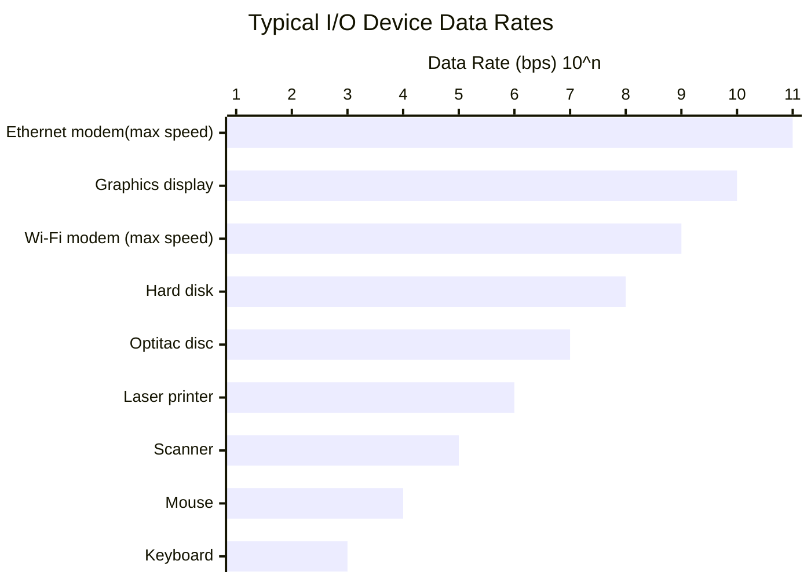

# Bab 2

## Designing for Performance

Over the years, the cost of computer systems has significantly decreased while their performance and capacity have dramatically increased. Modern laptops have the computing power of IBM mainframes from 10-15 years ago, making computing power nearly "free." This affordability has led to disposable microprocessors, such as those in digital pregnancy tests. The technological advancements have enabled complex applications. For example, desktop applications that require the great power of today's microprocessor-based systems include:

- Image processing
- 3D rendering
- Speech recognition
- Videoconferencing
- Multimedia authoring
- Voice and video annotation of files
- Simulation modeling

Workstations now support sophisticated engineering and scientific applications, while powerful servers handle transaction and database processing for businesses, replacing old mainframe centers. Cloud service providers also use high-performance servers for high-volume applications. Interestingly, the basic building blocks of modern computers are similar to those from over 50 years ago, but the techniques to maximize performance have become more sophisticated.

### Microprocessor Speed

What gives Intel x86 processors or IBM mainframe computers such power is the relentless pursuit of speed by processor chip manufacturers. The evolution of these machines continues to bear out Moore's law.

#### Techniques Built Into Contemporary Processors

- **Pipelining**: The execution of an instruction involves multiple stages of operation and pipelining enables a processor to work simultaneously on multiple instructions by performing a different phase for each of the multiple instructions at the same time. The processor overlaps operations by moving data or instructions into a conceptual pipw with all stages of the pipe processing simultaneously.

  > Example: While one instruction is being executed, the computer is decoding the next instruction.

- **Branch prediction**: The processor looks ahead in the instruction code fetched rom memory and predicts which branches, or groups of instructions, are likely to be processed next. If the processor guesses right most of the time, it can prefetch the correct instructions and buffer them so that the processor is kept busy. The more sophisticated examples of this strategy predict not just the next branch but multiple branches ahead. Thus, branch prediction potentially increases the amount of work available for the processor to execute.
- **Superscalar execution**: This is the ability to issue more than one instruction in every processor clock cycle. In effect, multiple paraller pipelines are used.
- **Data flow analysis**: The processor analyzes which instructions are dependent on each other's results, or data, to create an optimized schedule of instructions. In fact, instructions are scheduled to be executed when ready, independent of the original program order. This prevents unnecessary delay.
- **Speculative execution**: Using branch prediction and data flow analysis, some processors speculatively execute instructions ahead of their actual appearance in the program execution, holding the results in temporary locations. This enables the processor to keep its execution engines as busy as possible by executing instructions that are likely to be needed.

### Performance Balance

The processor power has increased while other components of the computer have not kept up. The result is the mismatch of performance across components. While processor speed has grown rapidly, the speed with which data can be transferred between main memory and the processor has lagged badly. If memory fails to keep pace with the processor's speed, the processor stalls in a wait state, and valuable processing time is lost.

There are some ways to overcome this problem.

- Increase the number of bits that are retrieved at one time by making DRAMs "wider" rather than "deeper" and by using wide bus data paths.
- Change the DRAM interface to make it more efficient by including a cache or other buffering scheme on the DRAM chip.
- Reduce the frequency of memory access by incorporating increasingly complex and efficient cache structures between the processor and main memory. This includes the incorporation of one or more caches on the processor chip as well as on an off-chip cache close to the processor chip.
- Increase the interconnect bandwith between processors and memory by using higher-speed buses and a hirerachy of buses to buffer and structure data flow.

Another area of design focus is the handling of I/O devices.

