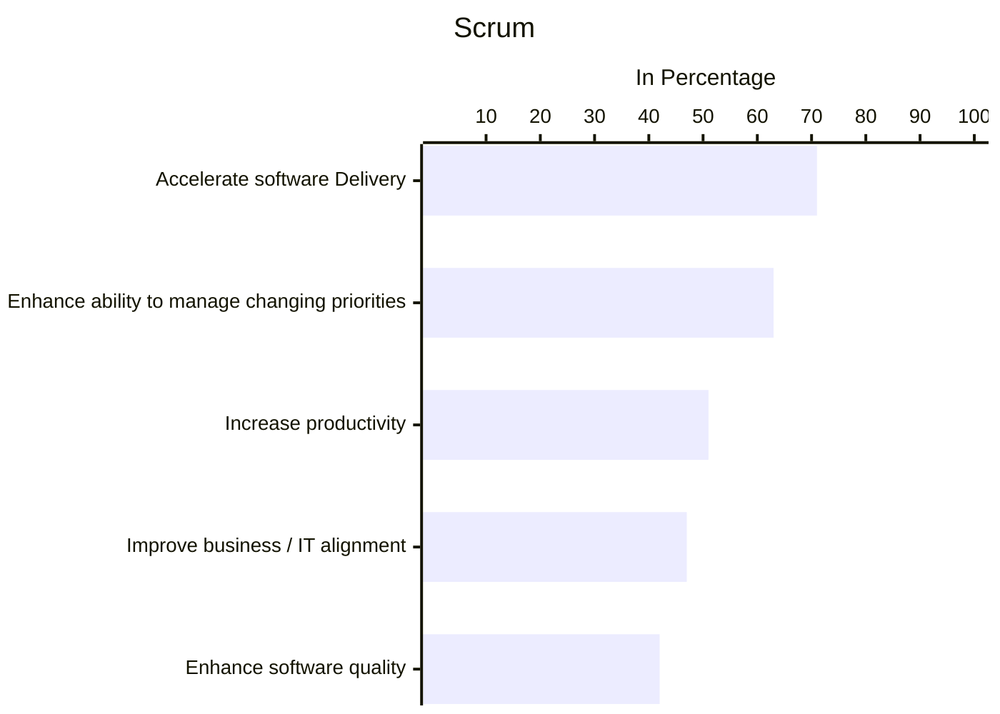

# BAB 6 SIMULASI MODEL AGILE SDLC -SCRUM

## Overview

- 58% of all Agile teams use the Scrum framework
- Teams choose to use the scrum framework because its simplicity and flexibility allows them to move faster while still staying organized

- Three pillars
  - **Transparency** -> all people infolved (the customer, the CEO, and individual contributors) are transparent in their day-to-day dealings with others; they all trust each other
  - **Inspection** -> the product, process, and progress must be ebaluated frequently as you go
  - **Adaption** -> the ability to adapt based on the results of the inspection; continuous imrpvement; are we better off than yesterday
- Key roles: product owner, scrum master, team sprint (scrum/development team)
